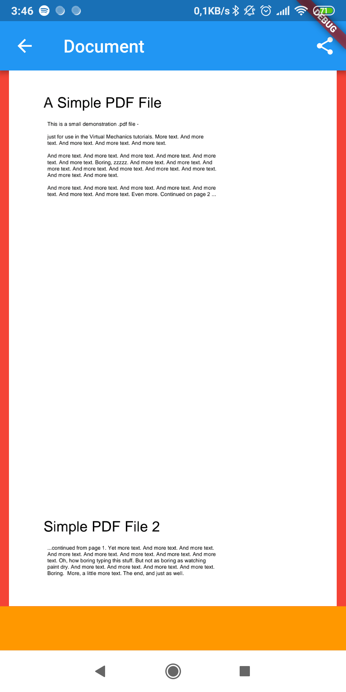
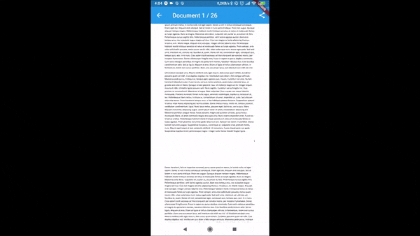
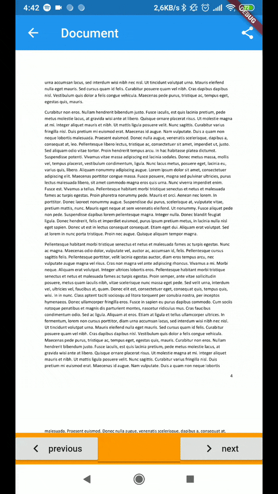

# flutter_full_pdf_viewer -> The pdf viewer for flutter

Android and iOS working pdf viewer!

# Use this package as a library

## 1. Depend on it

Add this to your package's pubspec.yaml file:

```
dependencies:
  flutter_full_pdf_viewer: ^1.0.3
```


### 2. Install it

You can install packages from the command line:

with Flutter:

```
$ flutter packages get
```

Alternatively, your editor might support pub get or ```flutter packages get```. Check the docs for your editor to learn more.


### 3. Import it

Now in your Dart code, you can use:

```
import 'package:flutter_full_pdf_viewer/flutter_full_pdf_viewer.dart';
import 'package:flutter_full_pdf_viewer/full_pdf_viewer_plugin.dart';
import 'package:flutter_full_pdf_viewer/full_pdf_viewer_scaffold.dart';
```

### 4. Informations for Release on Android

You have to follow first these steps: https://flutter.io/docs/deployment/android
After that you have to add ndk filters to your release config:

```
    buildTypes {

        release {
            signingConfig signingConfigs.release
            minifyEnabled true
            useProguard true
            proguardFiles getDefaultProguardFile('proguard-android.txt'), 'proguard-rules.pro'

            ndk {
                abiFilters 'armeabi-v7a'
            }
        }

        debug {
            minifyEnabled false
            useProguard false
        }
    }

```
Now your release app should work.


### 5. Configurations and updates

There are several ways to configure the viewer, so that you can customize some of the appearance and behaviour.

##### 5.1 Customize layout

By setting some variables to the `PDFViewerScaffold`, you can change the amount of space the rendered pdf view will take, to allow setting a widget/actionbuttons below the view.

```
  return PDFViewerScaffold(       
        path: pathPDF,
        left: 10,
        right: 10,
        bottomWidget: PreferredSize(child: Container(
              color: Colors.orange,
            ),
            preferredSize: Size(double.infinity, 50))
```




#### 5.2 Listen for page change

To listen to pagechanges happening while the user scrolls through the pdf, you'll have to listen to `FullPdfViewerPageChangeNotification` using a `NotificationListener` wrapping the `PDFViewerScaffold`:

```
import 'package:flutter_full_pdf_viewer/models/full_pdf_viewer_page_change_notification.dart';

...

return NotificationListener<FullPdfViewerPageChangeNotification>(
        onNotification: (FullPdfViewerPageChangeNotification notification) {
          setState(() {
            page = notification.page + 1;
            pageCount = notification.pageCount;
          });
          return true;
        },
        child: PDFViewerScaffold(
            appBar: AppBar(
              title: Text("Document $page / $pageCount"),
              ....
```
*be aware that pages start at 0, which is why the `page` variable gets increased by one while retrieving the notification*



 #### 5.3 Initiate page changes

 To jump to a specific page, you'll need to dispatch a `FullPdfViewerSetPageNotification` at the `Buildcontext` of the `PDFViewerScaffold`. To get that context, listen to a `FullPdfViewerContextNotification`, which will provide the correct context everytime the scaffold gets build.

 Therefore, you need to import those,

 ```
import 'package:flutter_full_pdf_viewer/models/full_pdf_viewer_set_page_notification.dart';
import 'package:flutter_full_pdf_viewer/models/full_pdf_viewer_context_notification.dart';
```

wrap the `PDFViewerScaffold` with the `NotificationListener`
```
return NotificationListener<FullPdfViewerContextNotification>(
        onNotification: (FullPdfViewerContextNotification notification) {
          // pdfViewerBuildContext is a variable of the current statefulwidgets state
          pdfViewerBuildContext =notification.context;
          return true;
        },
        child: PDFViewerScaffold(
            ....
 ```

so that you can dispatch `FullPdfViewerSetPageNotification` in that context, using an incrementing/decrementing value like

```
 FullPdfViewerSetPageNotification(change: -1)..dispatch(pdfViewerBuildContext);
```

or a fix page number like

```
FullPdfViewerSetPageNotification(page: 5)..dispatch(pdfViewerBuildContext))
```

*as before, be aware that pages start at 0, so setting the current page to 5 will actually take you to the 6th page in the document*



